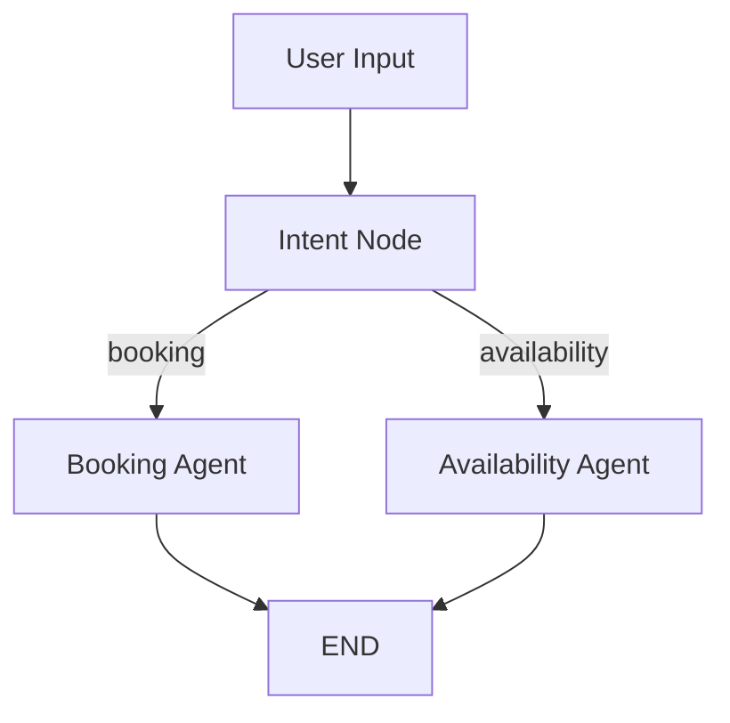

# Doctor AI Scheduler

AI-powered Doctor Appointment Scheduler built using Python, LangGraph, and Google Calendar API.

This project demonstrates:
- agentic workflows
- conversational AI orchestration
- multi-turn stateful conversations
- calendar automation
- LangGraph routing
- Google OAuth integration

---

# Features

## Appointment Booking
Book doctor appointments using natural language.

Examples:

- Book appointment tomorrow 8 PM
- Schedule consultation Friday 11 AM
- Book doctor visit next Tuesday 5 PM

---

## Availability Checking

Check doctor availability directly from Google Calendar.

Examples:

- Is doctor available tomorrow 5 PM?
- Is doctor free Friday 11 AM?
- Check availability next Monday 4 PM

---

## Multi-Turn Conversations

Supports follow-up conversations.

Example:

User:
```text
Book appointment tomorrow
```

Bot:
```text
What time would you like to book the appointment?
```

User:
```text
8 PM
```

Bot:
```text
Appointment booked successfully...
```

---

# Tech Stack

- Python
- LangGraph
- LangChain
- Google Calendar API
- OAuth 2.0
- dateparser

---

# Architecture

```text
User Input
    ↓
Intent Detection
    ↓
LangGraph Router
    ↓
Booking Agent / Availability Agent
    ↓
Google Calendar Tool
    ↓
Google Calendar API
```

---

# Project Structure

```text
doctor_agent_scheduler/
│
├── agents/
│   ├── booking_agent.py
│   ├── availability_agent.py
│   └── intent_agent.py
│
├── graph/
│   └── doctor_graph.py
│
├── tools/
│   └── google_calendar_tool.py
│
├── utils/
│   └── datetime_parser.py
│
├── tests/
│
├── main.py
├── requirements.txt
├── README.md
└── .gitignore
```

---

# Installation

## Clone Repository

```bash
git clone https://github.com/YOUR_USERNAME/doctor-ai-scheduler.git

cd doctor-ai-scheduler
```

---

## Create Virtual Environment

### Windows

```bash
python -m venv venv

venv\Scripts\activate
```

### Mac/Linux

```bash
python3 -m venv venv

source venv/bin/activate
```

---

## Install Dependencies

```bash
pip install -r requirements.txt
```

---

# Google Calendar Setup

## 1. Create Google Cloud Project

Go to:

https://console.cloud.google.com/

---

## 2. Enable Google Calendar API

Enable:

- Google Calendar API

---

## 3. Configure OAuth Consent Screen

Choose:
- External

Add:
- App name
- Support email

Add your email under:
- Test Users

---

## 4. Create OAuth Credentials

Create:
- OAuth Client ID
- Desktop Application

Download:
```text
credentials.json
```

Place inside project root.

---

# Run Application

```bash
python main.py
```

---

# Example Usage

## Check Availability

```text
You: Is doctor available tomorrow 5 PM?

Bot: Doctor is available on 13 May 2026 at 05:00 PM
```

---

## Book Appointment

```text
You: Book appointment Friday 11 AM

Bot: Appointment booked successfully for 15 May 2026 at 11:00 AM
```

---

# LangGraph Workflow

```text
                ┌────────────────┐
                │  Intent Node   │
                └───────┬────────┘
                        │
         ┌──────────────┴──────────────┐
         │                             │
         ▼                             ▼
┌─────────────────┐         ┌────────────────────┐
│ Booking Agent   │         │ Availability Agent │
└────────┬────────┘         └─────────┬──────────┘
         │                            │
         └────────────┬───────────────┘
                      ▼
                   END
```

---

# Implemented Capabilities

- Natural language scheduling
- Google Calendar integration
- Appointment conflict detection
- Multi-turn conversations
- Stateful workflows
- LangGraph orchestration
- Intent-based routing

---

# Future Enhancements

- Appointment cancellation
- Rescheduling workflow
- Persistent memory
- FastAPI backend
- Streamlit UI
- WhatsApp integration
- Multi-doctor scheduling
- LLM-based intent routing

---

# Security Notes

Do NOT upload:

- credentials.json
- token.json

Use `.gitignore`.

---

# Learning Outcomes

This project demonstrates practical understanding of:

- AI agent orchestration
- LangGraph workflows
- conversational memory
- external tool integration
- Google OAuth
- calendar automation
- stateful AI systems

---
# LangGraph Workflow


# License

MIT License
